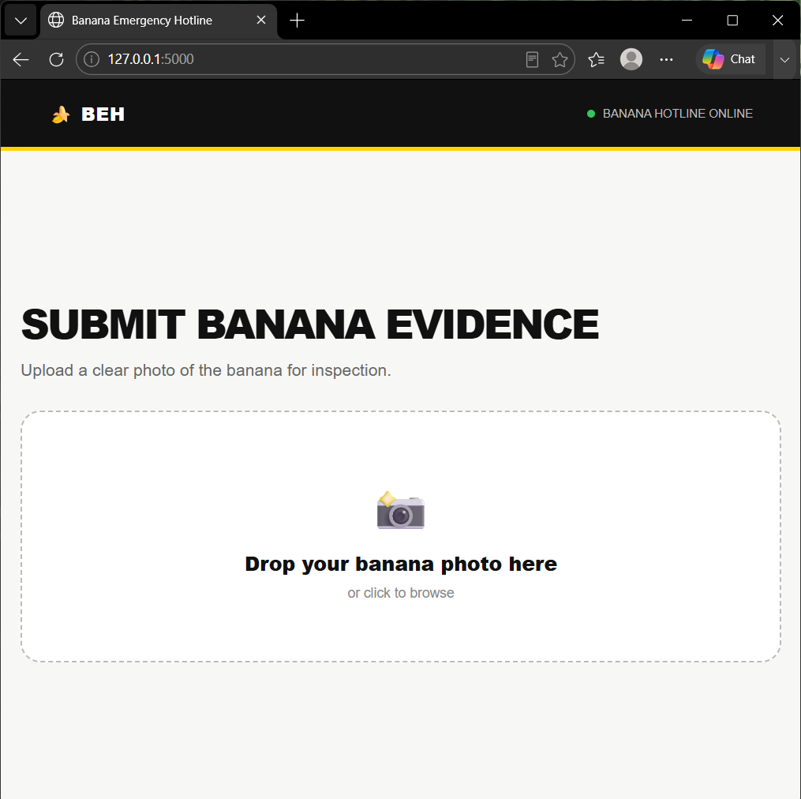
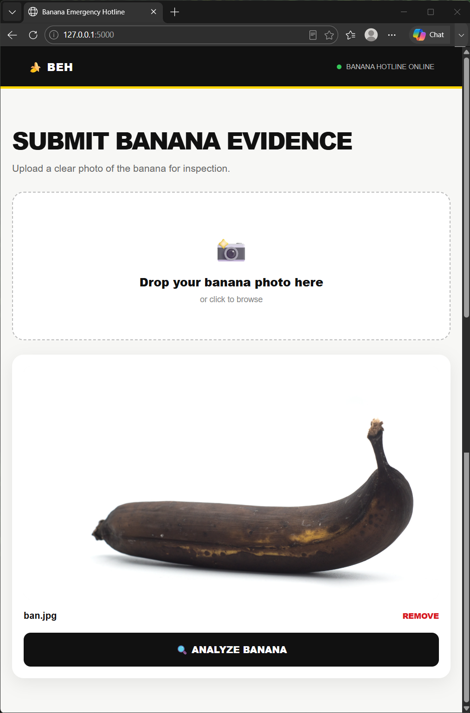
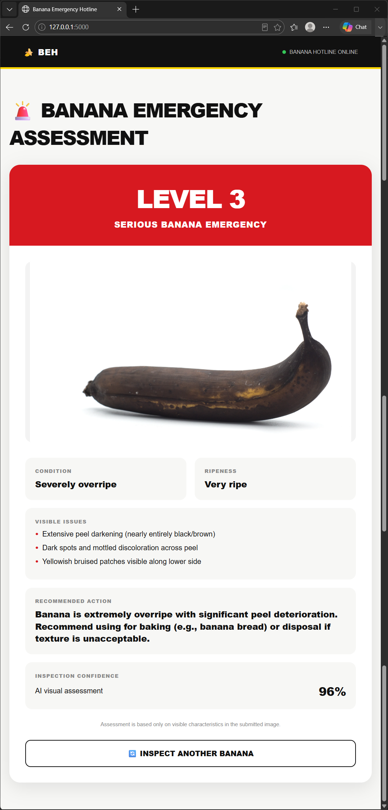

# [🍌 Banana Emergency Hotline] 🎯


## Basic Details
### Team Name: Trojan Horses


### Team Members
- Team Lead: Abel Eby - AISAT
- Member 2: Mayooghlal P - AISAT

### Project Description
**Banana Emergency Hotline** is a fun AI-powered web application that analyzes a photo of a banana and generates an emergency-style condition assessment.

Upload a banana photo, let the AI inspect it, and receive a banana emergency level from **Level 0 to Level 4** based on its visible condition.

The project turns an ordinary banana into a completely unnecessary but entertaining AI-powered emergency situation.


### The Problem (that doesn't exist)
Bananas are constantly going through critical situations.

They are getting too ripe, developing suspicious brown spots, suffering mysterious discoloration, and slowly approaching the point of no return.

Yet nobody has created a proper emergency response system for them.

**Who is going to save the banana?**

There was clearly a need for a highly advanced emergency hotline dedicated entirely to banana-related incidents.

So we decided to solve a problem that absolutely nobody asked us to solve.

### The Solution (that nobody asked for)
Introducing the **Banana Emergency Hotline**.

Users simply upload a photo of their banana and our AI-powered inspection system examines its visible condition.

The AI evaluates:

- 🍌 Whether the image contains a banana
- 🌱 Ripeness
- 🔍 Visible issues
- 🚨 Emergency severity
- 🛠️ Recommended action
- 🎯 Confidence

The banana is then assigned an emergency level:

| Level | Status |
|---|---|
| 🟢 Level 0 | ALL CLEAR |
| 🟡 Level 1 | LOW CONCERN |
| 🟠 Level 2 | BANANA ALERT |
| 🔴 Level 3 | SERIOUS BANANA EMERGENCY |
| 🚨 Level 4 | CRITICAL BANANA EMERGENCY |

Because apparently, bananas deserve emergency response infrastructure too.


## Technical Details
### Technologies/Components Used
For Software:
**Languages used:**
- Python
- HTML
- CSS
- JavaScript

**Frameworks used:**
- Flask

**Libraries used:**
- Requests

**AI / APIs:**
- OpenRouter API

**Tools used:**
- Visual Studio Code
- Git
- GitHub
- Python Virtual Environment

For Hardware:
Not applicable.

This is a software-only project and does not require any additional hardware components.


### Implementation
For Software:
The application consists of a simple Flask backend and a web-based frontend.

The user uploads a banana image through the website. The Flask backend receives the image, converts it into a format suitable for the AI API, and sends it to OpenRouter for visual analysis.

The AI returns a structured assessment containing the banana's condition, ripeness, visible issues, severity, recommendation, and confidence.

The result is then displayed as an emergency assessment on the website.
# Installation
1. Clone the repository

```bash
git clone YOUR_GITHUB_REPOSITORY_URL
```

2. Open the project folder

```bash
cd useless_project_temp
```

3. Create a virtual environment

```bash
python -m venv venv
```

4. Activate the virtual environment

For Windows PowerShell:

```powershell
.\venv\Scripts\Activate.ps1
```

5. Install dependencies

```bash
pip install flask requests
```

---

# API Key Setup

This project uses the **OpenRouter API** for AI-powered image analysis.

Set your OpenRouter API key as an environment variable.

For Windows PowerShell:

```powershell
$env:OPENROUTER_API_KEY="YOUR_OPENROUTER_API_KEY"
```

# Run
Start the Flask application:

```bash
python app.py
```

The application will run at:

```text
http://127.0.0.1:5000
```

Open the address in a web browser to use the Banana Emergency Hotline.

### Project Documentation
For Software:

# Screenshots

*The landing page introduces the Banana Emergency Hotline and allows the user to begin a banana inspection.*


*The upload page allows users to submit a banana image and preview it before starting the AI analysis.*


*The assessment page displays the AI-generated banana condition, ripeness, visible issues, emergency level, recommendation, and confidence score.*


# Diagrams
![Workflow]

              ┌──────────────────┐
              │       User       │
              └────────┬─────────┘
                       │
                       ▼
              ┌──────────────────┐
              │ Upload Banana    │
              │     Image        │
              └────────┬─────────┘
                       │
                       ▼
              ┌──────────────────┐
              │ Flask Backend    │
              │     Python       │
              └────────┬─────────┘
                       │
                       ▼
              ┌──────────────────┐
              │   OpenRouter AI  │
              │  Vision Analysis │
              └────────┬─────────┘
                       │
                       ▼
              ┌──────────────────┐
              │ Banana Analysis  │
              │    Level 0–4     │
              └────────┬─────────┘
                       │
                       ▼
              ┌──────────────────┐
              │ Emergency        │
              │ Assessment       │
              └──────────────────┘


*The application receives a banana image, sends it to the Flask backend, uses OpenRouter for AI vision analysis, and displays the resulting banana emergency assessment.*


### Project Demo
# Video
[https://drive.google.com/file/d/1uq6MjH4iRNwliKhNIxI2SFCPKlS9XplJ/view?usp=sharing]
*The demo video shows the complete workflow of the Banana Emergency Hotline, from uploading a banana image to receiving the AI-generated emergency assessment.*


# Additional Demos
The application can be tested with different images, including:

- Healthy-looking bananas
- Ripe bananas
- Overripe bananas
- Bananas with visible brown spots
- Bananas with visible bruising or discoloration
- Non-banana objects

These different inputs demonstrate how the AI responds to different visual conditions.

## Team Contributions
- **Abel Eby:** Project concept, application development, Python/Flask backend, OpenRouter AI integration, image analysis workflow, and testing.
- **Mayooghlal P:** Project development, testing, feedback, and documentation.

---
Made with ❤️ at TinkerHub Useless Projects 


